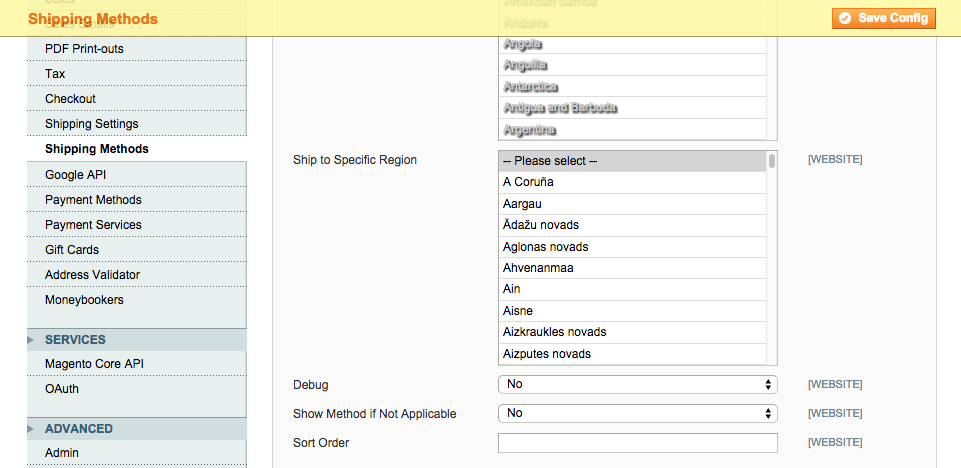

Ship To Region
==============

Allow specific regions/states to ship to. 

Description
-----------
In Magento you can allow/disallow countries that you ship to. Not so for region/states. 
This module adds that ability.

How to use
----------
There are two configuration areas to configure shipping regions:

1. System -> Confifiguration -> General -> General -> States Options -> Allow Region/States 
2. System -> Confifiguration -> Sales -> Shipping Methods -> [CARRIER] -> Ship to Specific Region 
